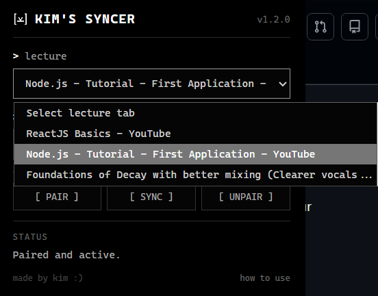
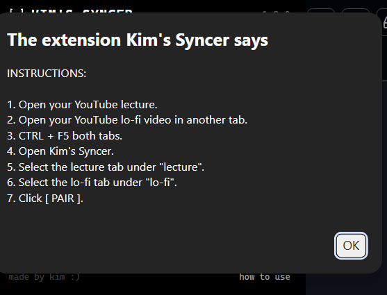
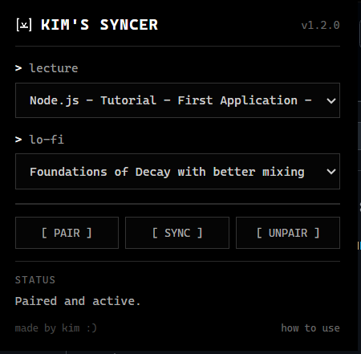

# Description
A Chrome extension that sychronizes a YouTube video/lecture tab with a YouTube video/music tab. This way, you can play music after you pause your lecture, and pause it again when you study again. 

# Why I made this
Laziness. Kidding. I made this because after I watch a lecture video, I usually try the code myself in my IDE. Then there's just silence. It's boring. For me, I can't just have the music play while watching the lecture because it's distracting. This saves me my time and attention. 

# Screenshots

  
   
   

# Installation

1. Clone or download this repository.
2. Open Chrome and go to: chrome://extensions
3. Enable Developer mode.
4. Click Load unpacked.
5. Select this project's folder.
6. Open two YouTube tabs:
- One for your lecture
- One for your lo-fi
7. Refresh or Ctrl + F5 both YouTube tabs if you have just reloaded or updated the extension.
8. Open Kim's Syncer.
9. Select the lecture and lo-fi tabs.
10. Click [ PAIR ].